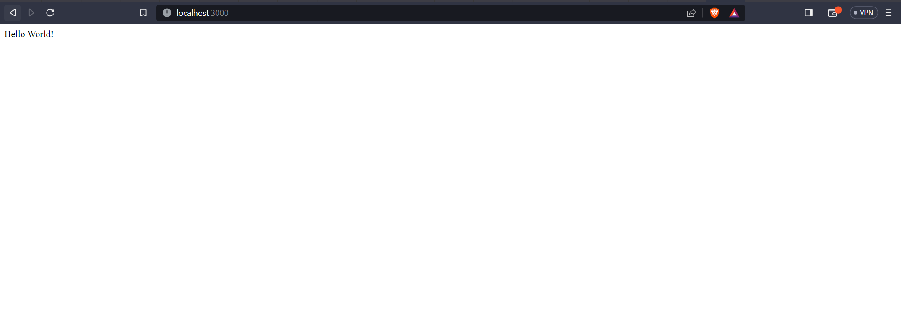
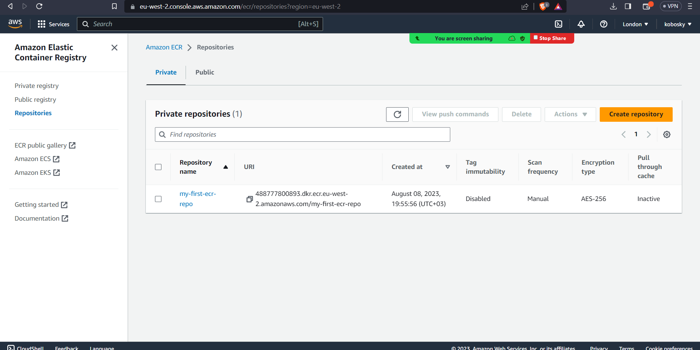
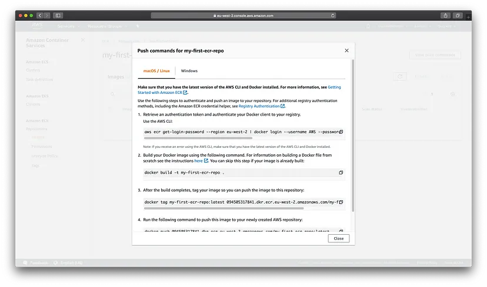
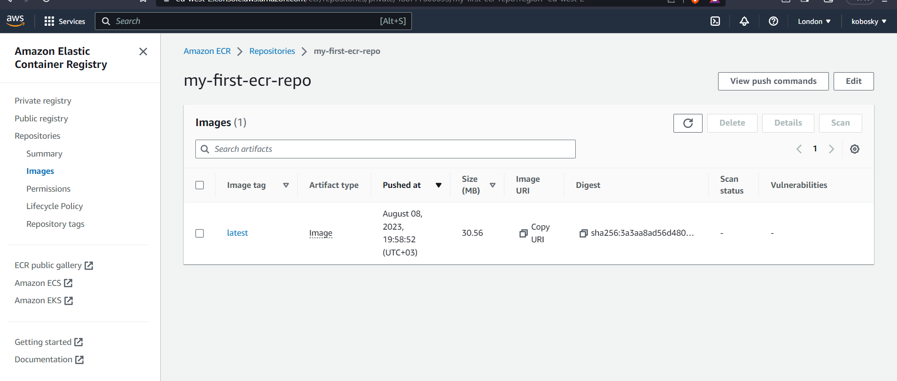
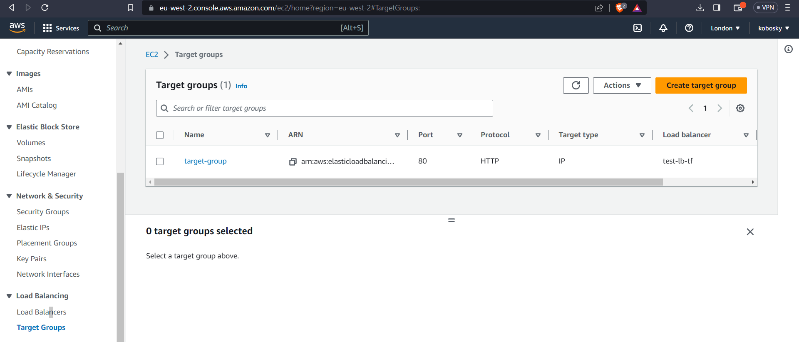
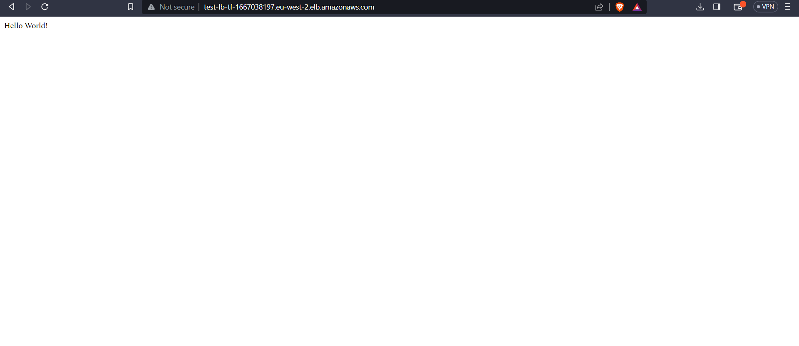
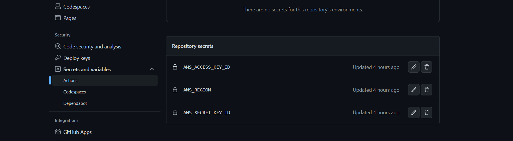
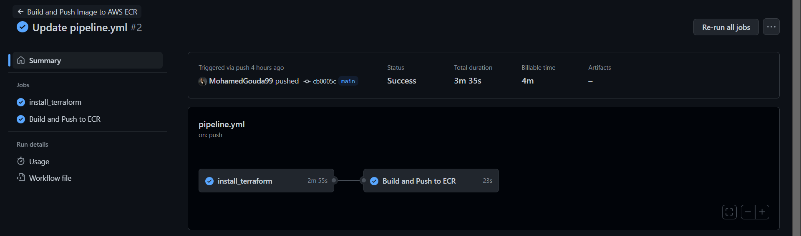

# Deploy a Dockerised Application on AWS ECS With Terraform

We will follow these steps:
1.	Create a simple Node app and run it locally.
2.	Dockerize the Node app.
3.	Create an image repository on AWS ECR and push the image.
4.	Create an AWS ECS cluster.
5.	Create an AWS ECS task.
6.	Create an AWS ECS service.
7.	Create a load balancer.

## The technologies used in this guide are:

[Amazon ECS](https://aws.amazon.com/ecs/) — a fully managed container orchestration service

[Amazon ECR](https://aws.amazon.com/ecr/) — a fully-managed Docker container registry

[Terraform](https://developer.hashicorp.com/terraform/tutorials/aws-get-started/install-cli) — an open-source infrastructure as code tool

### Prerequisites
1. An AWS account
2. Node installed
3. Docker installed and some experience using it
4. Terraform installed

# Step 1. Create a Simple Node App
First, run the following commands to create and navigate to our application’s directory:
```ssh
$ mkdir node-docker-ecs
$ cd node-docker-ecs
 ```
### Next, create an npm project:
```ssh
$ npm init --y
```
### Install Express:
```ssh
$ Install Express:
```
### Create an index.js file with the following code:
```ssh
const express = require('express')
const app = express()
const port = 3000

app.get('/', (req, res) => res.send('Hello World!'))

app.listen(port, () => console.log(`Example app listening on port ${port}!`))
```
### The app can then run with this command:
```ssh
$ node index.js
```
#### You should see your app at http://localhost:3000/:


## Step 2. Dockerize the Node App
If you are new to Docker, I highly recommend this course by Stephen Grider or the official getting started guide. I promise that they are well worth your time.

Create a Dockerfile in your project directory and populate it with the following code:
```ssh
# Use an official Node runtime as a parent image
FROM node:12.7.0-alpine

# Set the working directory to /app
WORKDIR '/app'

# Copy package.json to the working directory
COPY package.json .

# Install any needed packages specified in package.json
RUN yarn

# Copying the rest of the code to the working directory
COPY . .

# Make port 3000 available to the world outside this container
EXPOSE 3000

# Run index.js when the container launches
CMD ["node", "index.js"]
```
## Step 3. Push the Node App to AWS ECR
Now it is time we pushed our container to a container registry service — in this case, we will use AWS ECR:


Instead of using the AWS UI, we will use terraform to create our repository. In your directory create a file called main.tf. Populate your file with the following commented code:

```ssh
provider "aws" {
  version = "~> 2.0"
  region  = "eu-west-2" # Setting my region to London. Use your own region here
}

resource "aws_ecr_repository" "my_first_ecr_repo" {
  name = "my-first-ecr-repo" # Naming my repository
}
```
Next, in your terminal, type:
```ssh
terraform init
terraform apply
```
We will be using the terraform apply command repeatedly throughout this tutorial to deploy our changes. If you then navigate to the AWS ECR service, you should see your newly created repository:


Now we can push our Node application image up to this repository. Click on the repository and click View push commands. A modal will appear with four commands you need to run locally in order to have your image pushed up to your repository:



Once you have run these commands, you should see your pushed image in your repository:



## AWS ECS
Amazon Elastic Container Service (Amazon ECS) is a fully managed container orchestration service. AWS ECS is a fantastic service for running your containers. In this guide we will be using ECS Fargate, as this is a serverless compute service that allows you to run containers without provisioning servers.

ECS has three parts: clusters, services, and tasks.

Tasks are JSON files that describe how a container should be run. For example, you need to specify the ports and image location for your application. A service simply runs a specified number of tasks and restarts/kills them as needed. This has similarities to an auto-scaling group for EC2. A cluster is a logical grouping of services and tasks. This will become more clear as we build.

### Step 4. Create the Cluster:

```ssh
resource "aws_ecs_cluster" "my_cluster" {
  name = "my-cluster" # Naming the cluster
}
```

### Step 5. Create the First Task
Creating a task is a bit more involved than creating a cluster. Add the following commented code to your terraform script:

```ssh
resource "aws_ecs_task_definition" "my_first_task" {
  family                   = "my-first-task" # Naming our first task
  container_definitions    = <<DEFINITION
  [
    {
      "name": "my-first-task",
      "image": "${aws_ecr_repository.my_first_ecr_repo.repository_url}",
      "essential": true,
      "portMappings": [
        {
          "containerPort": 3000,
          "hostPort": 3000
        }
      ],
      "memory": 512,
      "cpu": 256
    }
  ]
  DEFINITION
  requires_compatibilities = ["FARGATE"] # Stating that we are using ECS Fargate
  network_mode             = "awsvpc"    # Using awsvpc as our network mode as this is required for Fargate
  memory                   = 512         # Specifying the memory our container requires
  cpu                      = 256         # Specifying the CPU our container requires
  execution_role_arn       = "${aws_iam_role.ecsTaskExecutionRole.arn}"
}

resource "aws_iam_role" "ecsTaskExecutionRole" {
  name               = "ecsTaskExecutionRole"
  assume_role_policy = "${data.aws_iam_policy_document.assume_role_policy.json}"
}

data "aws_iam_policy_document" "assume_role_policy" {
  statement {
    actions = ["sts:AssumeRole"]

    principals {
      type        = "Service"
      identifiers = ["ecs-tasks.amazonaws.com"]
    }
  }
}

resource "aws_iam_role_policy_attachment" "ecsTaskExecutionRole_policy" {
  role       = "${aws_iam_role.ecsTaskExecutionRole.name}"
  policy_arn = "arn:aws:iam::aws:policy/service-role/AmazonECSTaskExecutionRolePolicy"
}
```

Notice how we specify the image by referencing the repository URL of our other terraform resource. Also notice how we provide the port mapping of 3000. We also create an IAM role so that tasks have the correct permissions to execute. If you click Task Definitions in AWS ECS, you should see your new task.

## Step 6. Create the First Service
Great! Now we have a cluster and a task definition. It is time that we spun up a few containers in our cluster through the creation of a service that will use our newly created task definition as a blueprint. If we examine the documentation in Terraform for an ECS service, we find that we need the following terraform code as a minimum:

```ssh
resource "aws_ecs_service" "my_first_service" {
  name            = "my-first-service"                             # Naming our first service
  cluster         = "${aws_ecs_cluster.my_cluster.id}"             # Referencing our created Cluster
  task_definition = "${aws_ecs_task_definition.my_first_task.arn}" # Referencing the task our service will spin up
  launch_type     = "FARGATE"
  desired_count   = 3 # Setting the number of containers we want deployed to 3
}
```

However, if you try to deploy this, you will get the following error:

```ssh
Network Configuration must be provided when networkMode 'awsvpc' is specified
```
As we are using Fargate, our tasks need to specify that the network mode is awsvpc. As a result, we need to extend our service to include a network configuration. You may have not known it yet, but our cluster was automatically deployed into your account’s default VPC. However, for a service, this needs to be explicitly stated, even if we wish to continue using the default VPC and subnets. First, we need to create reference resources to the default VPC and subnets so that they can be referenced by our other resources:

```ssh
# Providing a reference to our default VPC
resource "aws_default_vpc" "default_vpc" {
}

# Providing a reference to our default subnets
resource "aws_default_subnet" "default_subnet_a" {
  availability_zone = "eu-west-2a"
}

resource "aws_default_subnet" "default_subnet_b" {
  availability_zone = "eu-west-2b"
}

resource "aws_default_subnet" "default_subnet_c" {
  availability_zone = "eu-west-2c"
}
```

Next, adjust your service to reference the default subnets:

```ssh
resource "aws_ecs_service" "my_first_service" {
  name            = "my-first-service"                             # Naming our first service
  cluster         = "${aws_ecs_cluster.my_cluster.id}"             # Referencing our created Cluster
  task_definition = "${aws_ecs_task_definition.my_first_task.arn}" # Referencing the task our service will spin up
  launch_type     = "FARGATE"
  desired_count   = 3 # Setting the number of containers we want deployed to 3

  network_configuration {
    subnets          = ["${aws_default_subnet.default_subnet_a.id}", "${aws_default_subnet.default_subnet_b.id}", "${aws_default_subnet.default_subnet_c.id}"]
    assign_public_ip = true # Providing our containers with public IPs
  }
}
```

## Step 7. Create a Load Balancer
The final step in this process is to create a load balancer through which we can access our containers. The idea is to have a single URL provided by our load balancer that, behind the scenes, will redirect our traffic to our underlying containers. Add the following commented terraform code:

```ssh
resource "aws_alb" "application_load_balancer" {
  name               = "test-lb-tf" # Naming our load balancer
  load_balancer_type = "application"
  subnets = [ # Referencing the default subnets
    "${aws_default_subnet.default_subnet_a.id}",
    "${aws_default_subnet.default_subnet_b.id}",
    "${aws_default_subnet.default_subnet_c.id}"
  ]
  # Referencing the security group
  security_groups = ["${aws_security_group.load_balancer_security_group.id}"]
}

# Creating a security group for the load balancer:
resource "aws_security_group" "load_balancer_security_group" {
  ingress {
    from_port   = 80 # Allowing traffic in from port 80
    to_port     = 80
    protocol    = "tcp"
    cidr_blocks = ["0.0.0.0/0"] # Allowing traffic in from all sources
  }

  egress {
    from_port   = 0 # Allowing any incoming port
    to_port     = 0 # Allowing any outgoing port
    protocol    = "-1" # Allowing any outgoing protocol 
    cidr_blocks = ["0.0.0.0/0"] # Allowing traffic out to all IP addresses
  }
}
```

To direct traffic we need to create a target group and listener. Each target group is used to route requests to one or more registered targets (in our case, containers). When you create each listener rule, you specify a target group and conditions. Traffic is then forwarded to the corresponding target group. Create these with the following:

```ssh
resource "aws_lb_target_group" "target_group" {
  name        = "target-group"
  port        = 80
  protocol    = "HTTP"
  target_type = "ip"
  vpc_id      = "${aws_default_vpc.default_vpc.id}" # Referencing the default VPC
  health_check {
    matcher = "200,301,302"
    path = "/"
  }
}

resource "aws_lb_listener" "listener" {
  load_balancer_arn = "${aws_alb.application_load_balancer.arn}" # Referencing our load balancer
  port              = "80"
  protocol          = "HTTP"
  default_action {
    type             = "forward"
    target_group_arn = "${aws_lb_target_group.target_group.arn}" # Referencing our tagrte group
  }
}
```

If you click on your target group and then click the Targets tag, you will see a message saying, “There are no targets registered to this target group”. This is because we have not linked our ECS service to our load balancer. We can change this by altering our service code to reference the targets:

```ssh
resource "aws_ecs_service" "my_first_service" {
  name            = "my-first-service"                             # Naming our first service
  cluster         = "${aws_ecs_cluster.my_cluster.id}"             # Referencing our created Cluster
  task_definition = "${aws_ecs_task_definition.my_first_task.arn}" # Referencing the task our service will spin up
  launch_type     = "FARGATE"
  desired_count   = 3 # Setting the number of containers to 3

  load_balancer {
    target_group_arn = "${aws_lb_target_group.target_group.arn}" # Referencing our target group
    container_name   = "${aws_ecs_task_definition.my_first_task.family}"
    container_port   = 3000 # Specifying the container port
  }

  network_configuration {
    subnets          = ["${aws_default_subnet.default_subnet_a.id}", "${aws_default_subnet.default_subnet_b.id}", "${aws_default_subnet.default_subnet_c.id}"]
    assign_public_ip = true # Providing our containers with public IPs
  }
}
```

Then if you refresh the Targets tab, you should see your three containers:



Note how the status of each container is unhealthy. This is because the ECS service does not allow traffic in by default. We can change this by creating a security group for the ECS service that allows traffic only from the application load balancer security group:

```ssh
resource "aws_ecs_service" "my_first_service" {
  name            = "my-first-service"                             # Naming our first service
  cluster         = "${aws_ecs_cluster.my_cluster.id}"             # Referencing our created Cluster
  task_definition = "${aws_ecs_task_definition.my_first_task.arn}" # Referencing the task our service will spin up
  launch_type     = "FARGATE"
  desired_count   = 3 # Setting the number of containers to 3

  load_balancer {
    target_group_arn = "${aws_lb_target_group.target_group.arn}" # Referencing our target group
    container_name   = "${aws_ecs_task_definition.my_first_task.family}"
    container_port   = 3000 # Specifying the container port
  }

  network_configuration {
    subnets          = ["${aws_default_subnet.default_subnet_a.id}", "${aws_default_subnet.default_subnet_b.id}", "${aws_default_subnet.default_subnet_c.id}"]
    assign_public_ip = true                                                # Providing our containers with public IPs
    security_groups  = ["${aws_security_group.service_security_group.id}"] # Setting the security group
  }
}


resource "aws_security_group" "service_security_group" {
  ingress {
    from_port = 0
    to_port   = 0
    protocol  = "-1"
    # Only allowing traffic in from the load balancer security group
    security_groups = ["${aws_security_group.load_balancer_security_group.id}"]
  }

  egress {
    from_port   = 0 # Allowing any incoming port
    to_port     = 0 # Allowing any outgoing port
    protocol    = "-1" # Allowing any outgoing protocol 
    cidr_blocks = ["0.0.0.0/0"] # Allowing traffic out to all IP addresses
  }
}
```

You should also be able to access your containers through your load balancer URL:



# Github Action Pipeline

Build and Push Image to AWS ECR
This GitHub Actions workflow automates the process of building and pushing a Docker image to an Amazon Elastic Container Registry (ECR) whenever changes are pushed to the 'main' branch of the repository.

### Workflow Description

This workflow consists of two main jobs:

### Job 1: Install Terraform and Apply Infrastructure
This job sets up the Terraform environment and applies infrastructure changes using Terraform scripts. It performs the following steps:

1. Checks out the repository code.
2. Installs necessary dependencies, including Terraform.
3. Displays the installed Terraform version.
4. Applies infrastructure changes by:

Initializing Terraform in the 'project' directory.

  Applying changes with auto-approval.

  Navigating to the 'remote_backend' directory.

  Initializing Terraform.

  Applying remote backend changes with auto-approval.

```ssh
name: Build and Push Image to AWS ECR

# Define the event trigger for the workflow
on:
  push:
    branches: [ main ]

# Define the jobs to be executed in the workflow
jobs:
  # Job to install Terraform and apply infrastructure
  install_terraform:
    runs-on: ubuntu-latest
    steps:
      # Step: Check out the repository code
      - name: Checkout code
        uses: actions/checkout@v2

      # Step: Install dependencies, including Terraform
      - name: Install dependencies
        env:
          AWS_ACCESS_KEY_ID: ${{secrets.AWS_ACCESS_KEY_ID}}
          AWS_SECRET_ACCESS_KEY: ${{secrets.AWS_SECRET_KEY_ID}}
          REGION: ${{secrets.AWS_REGION}}
        run: |
          sudo apt-get update
          sudo apt-get install -y unzip
          wget https://releases.hashicorp.com/terraform/1.0.9/terraform_1.0.9_linux_amd64.zip
          unzip terraform_1.0.9_linux_amd64.zip
          sudo mv terraform /usr/local/bin/

          echo "DONE"

      # Step: Display Terraform version
      - name: Build
        run: terraform version

      # Step: Apply infrastructure using Terraform
      - name: Apply
        run: |
          cd $GITHUB_WORKSPACE/project
          aws configure set aws_access_key_id ${{secrets.AWS_ACCESS_KEY_ID}}
          aws configure set aws_secret_access_key ${{secrets.AWS_SECRET_KEY_ID}}
          aws configure set default.region ${{secrets.AWS_REGION}}
          
          terraform init
          terraform apply --auto-approve 

          cd ../remote_backend
          terraform init
          terraform apply --auto-approve
```

Job 2: Build and Push Docker Image to ECR
This job builds a Docker image from the specified directory, tags it, and pushes it to an Amazon ECR repository. It depends on the successful completion of the previous job. The steps performed are as follows:
1.	Checks out the repository code.
2.	Configures AWS credentials for authentication.
3.	Logs in to Amazon ECR using the AWS CLI.
4.	Builds, tags, and pushes the Docker image to the Amazon ECR repository:

•	Builds the Docker image with the tag "latest" from the 'app_nodejs' directory.

•	Tags the Docker image with the ECR repository URL.

•	Pushes the Docker image to the ECR repository

```ssh
build-and-push:
    needs: install_terraform
    name: Build and Push to ECR
    runs-on: ubuntu-latest
    steps:
      # Step: Check out the repository code
      - name: Checkout
        uses: actions/checkout@v2

      # Step: Configure AWS credentials for authentication
      - name: Configure AWS credentials
        run: |
          aws configure set aws_access_key_id ${{secrets.AWS_ACCESS_KEY_ID}}
          aws configure set aws_secret_access_key ${{secrets.AWS_SECRET_KEY_ID}}
          aws configure set default.region ${{secrets.AWS_REGION}}

      # Step: Log in to Amazon ECR
      - name: Login to Amazon ECR
        id: login-ecr
        uses: aws-actions/amazon-ecr-login@v1

      # Step: Build, tag, and push Docker image to ECR
      - name: Build, Tag, and Push the Image to Amazon ECR
        id: build-image1
        run: |
          cd $GITHUB_WORKSPACE/app_nodejs
          docker build -t my-first-ecr-repo .
          docker tag my-first-ecr-repo:latest 488777800893.dkr.ecr.eu-west-2.amazonaws.com/my-first-ecr-repo:latest
          docker push 488777800893.dkr.ecr.eu-west-2.amazonaws.com/my-first-ecr-repo:latest

```

### Make sure the you will replace placeholders for variables in secrets section on your github repository.


### YOUR PIPELINE



# Do the following while destroying your infrastructure.

### Step 1: delete the image which is in your ECR repository by running the following commands:

```ssh
chmod +x delete_image.sh
./delete_image.sh
```
### Step 2: Empty the s3 from all objects.

Then do:
```ssh
terraform destroy
```


