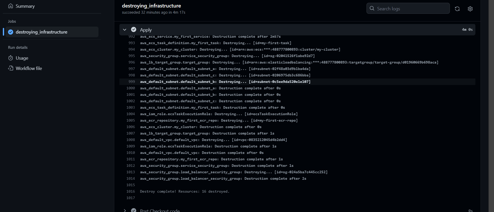

# How to destroy AWS Infrastructure
### To destroy using (terraform destroy, we need to do the following first:

### Step1: Restoring terraform.tfstate file from s3 bucket:

```
#!/bin/bash

# Set variables
BUCKET_NAME="sprints-remote-statefile"
KEY_NAME="terraform.tfstate"
LOCAL_PATH="./terraform.tfstate"

# Download the state file from S3
aws s3 cp s3://$BUCKET_NAME/$KEY_NAME $LOCAL_PATH

# Verify if the download was successful
if [ $? -eq 0 ]; then
  echo "Terraform state file successfully restored to $LOCAL_PATH"
else
  echo "Failed to restore Terraform state file"
fi
```
### Step2: delete image from ecr repository:

```
#!/bin/bash

# Set your AWS region
REGION="eu-west-2"

# List ECR repositories
echo "Listing ECR repositories..."
REPOS=$(aws ecr describe-repositories --region $REGION --output text --query 'repositories[*].repositoryName')

# Print the list of repositories
echo "Available ECR repositories:"
echo "$REPOS"

# Iterate through repositories and list/delete images
for REPO_NAME in $REPOS; do
    # List images in the current repository
    echo "Listing images in $REPO_NAME..."
    IMAGES=$(aws ecr list-images --region $REGION --repository-name $REPO_NAME --output text --query 'imageIds[*].imageTag')

    # Print the list of images
    echo "Images in $REPO_NAME:"
    echo "$IMAGES"

    # Loop through images and delete them
    for IMAGE_TAG in $IMAGES; do
        echo "Deleting image $REPO_NAME:$IMAGE_TAG..."
        aws ecr batch-delete-image --region $REGION --repository-name $REPO_NAME --image-ids imageTag=$IMAGE_TAG
    done
done
```
### Step3: empty and remove s3 bucket:
```
aws s3 rm s3://sprints-remote-statefile --recursive
aws s3 rb s3://sprints-remote-statefile
```

# Github Action workflow:
```
# This workflow builds and pushes a Docker image to AWS ECR when changes are pushed to the 'main' branch.

name: Build and Push Image to AWS ECR

# Define the event trigger for the workflow
on:
  push:
    branches: [ destroy ]

# Define the jobs to be executed in the workflow
jobs:
  # Job to install Terraform and apply infrastructure
  destroying_infrastructure:
    runs-on: ubuntu-latest
    steps:
      # Step: Check out the repository code
      - name: Checkout code
        uses: actions/checkout@v2

      # Step: Install dependencies, including Terraform
      - name: Install dependencies
        env:
          AWS_ACCESS_KEY_ID: ${{secrets.AWS_ACCESS_KEY_ID}}
          AWS_SECRET_ACCESS_KEY: ${{secrets.AWS_SECRET_KEY_ID}}
          REGION: ${{secrets.AWS_REGION}}
        run: |
          sudo apt-get update
          sudo apt-get install -y unzip
          wget https://releases.hashicorp.com/terraform/1.0.9/terraform_1.0.9_linux_amd64.zip
          unzip terraform_1.0.9_linux_amd64.zip
          sudo mv terraform /usr/local/bin/

          echo "DONE"

      # Step: Display Terraform version
      - name: verify terraform version
        run: terraform version

      # Step: Apply infrastructure using Terraform
      - name: Apply
        run: |
          cd $GITHUB_WORKSPACE/project/
          chmod +x delete_image.sh && chmod +x restore_tfstatefile.sh && chmod +x remove_s3.sh
          sudo apt install awscli
          aws configure set aws_access_key_id ${{secrets.AWS_ACCESS_KEY_ID}}
          aws configure set aws_secret_access_key ${{secrets.AWS_SECRET_KEY_ID}}
          aws configure set default.region ${{secrets.AWS_REGION}}
          ./restore_tfstatefile.sh
          ./delete_image.sh
          ./remove_s3.sh

          
          terraform init
          terraform destroy --auto-approve 
```

